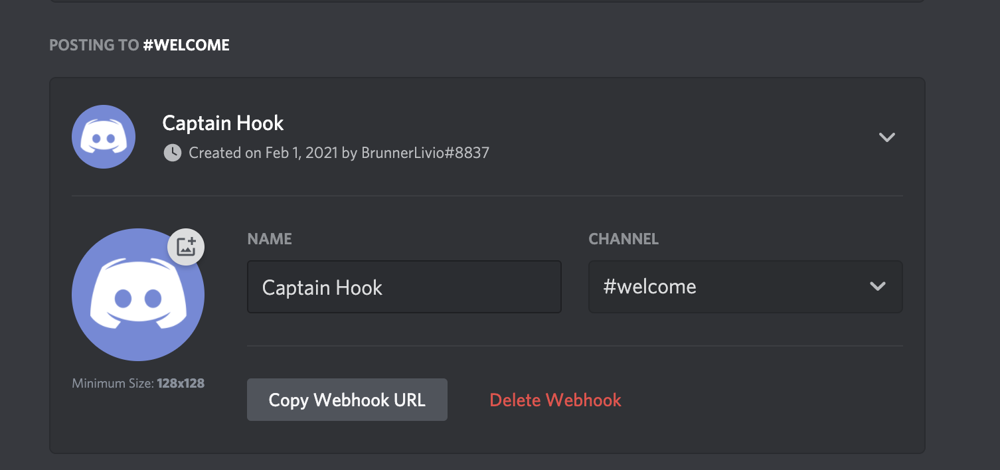
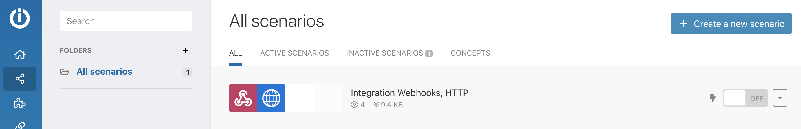
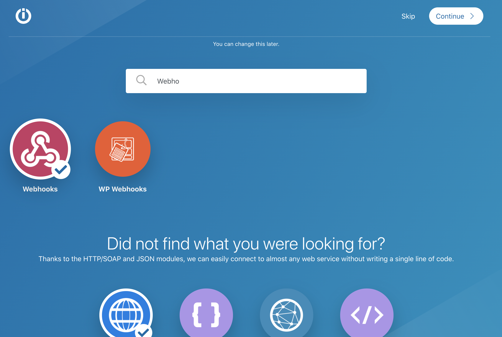
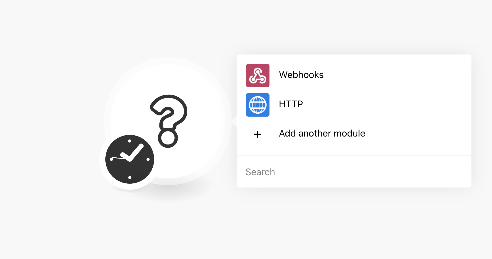
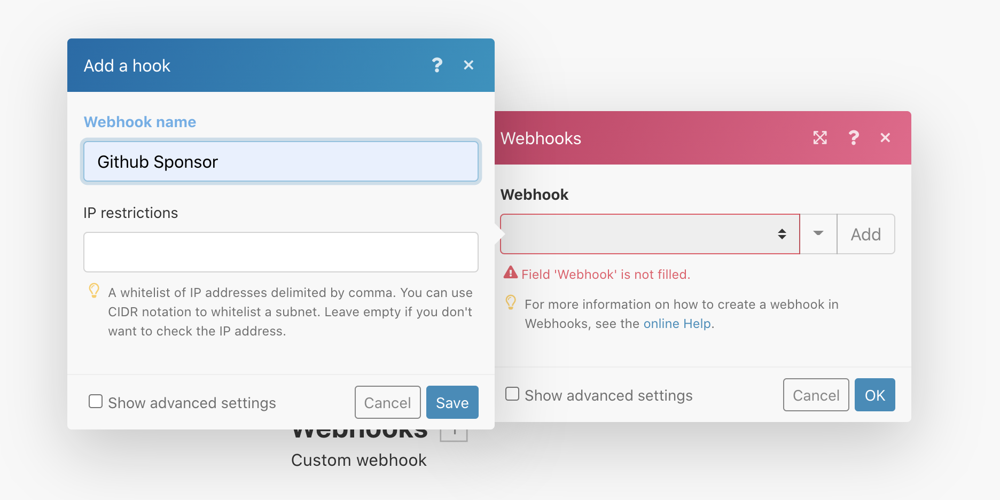
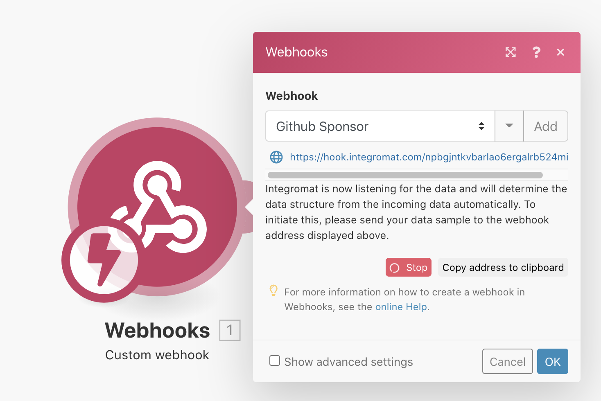
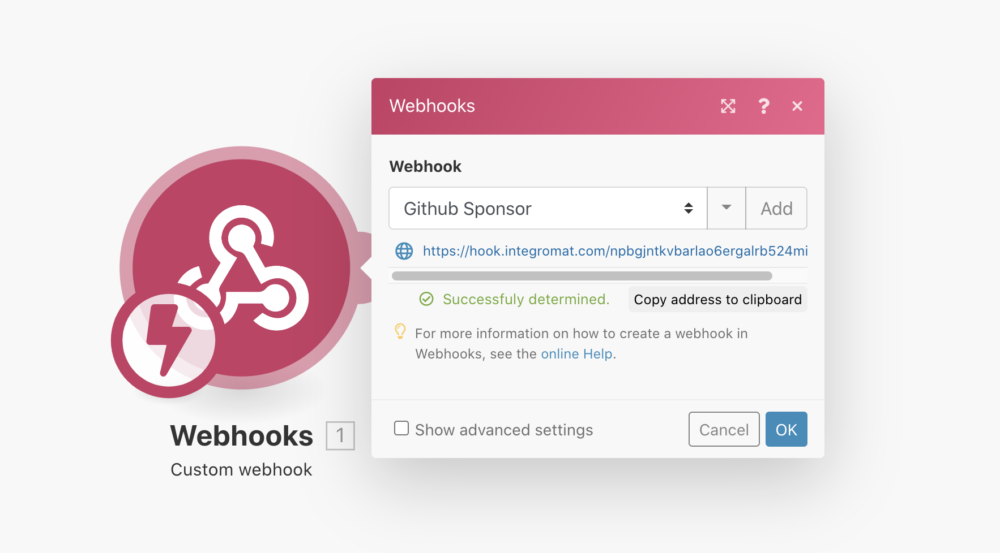
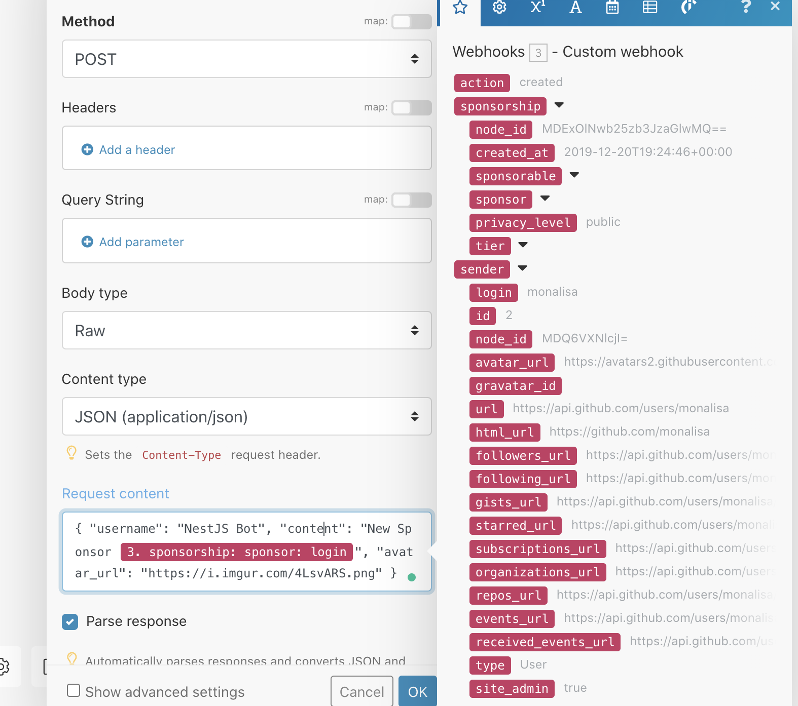

# Getting started

## Setup Discord Webhook

1. Go to your Discord Server
2. Go to your Server Settings (in the top left)
3. Click on **Integration**
4. Click on **Webhooks**
5. Click on the **New Webhook** Button
6. Configure it and **Copy Webhook URL**. Let's keep that badboy for later



## Setup Integromat

1. Register on [Integromat](https://www.integromat.com/) (it's free!)
2. Once you're logged into your Dashboard, click on **Scenarios**
3. Click on **Create a new scenario** (top left)



3. Search for Webhooks and Click on it and also select "HTTP" (you might need to scroll down a little)



4. Click on "Continue" (top right)

5. Click on "Webhooks"



6. Click on "Custom webhook"
7. Click on the "Add" Button in the new dialog



8. Save it.
9. You should now see a loading indicator within a small red Box with "Stop" in it. Next to it, it says "Copy address to clipboard". Click on that



10. Send the following cURL. Make sure to replace `<YOUR_URL>` with the copied URL above. Basically what we do here is sending a "dummy" webhook what Integromat will expect in the future. The purpose of this is that Integromat can store the data schema behind the JSON and give us a nice Intell-Sense later on. The JSON below I just copied from the [Github Sponsor Webhook Docs](https://docs.github.com/en/developers/webhooks-and-events/webhook-events-and-payloads#sponsorship), but you can use whatever you want off course :)

```bash
curl --location --request POST '<YOUR_URL>' \
--header 'Content-Type: application/json' \
--data-raw '{
  "action": "created",
  "sponsorship": {
    "node_id": "MDExOlNwb25zb3JzaGlwMQ==",
    "created_at": "2019-12-20T19:24:46+00:00",
    "sponsorable": {
      "login": "octocat",
      "id": 5,
      "node_id": "MDQ6VXNlcjU=",
      "avatar_url": "https://avatars2.githubusercontent.com/u/5?",
      "gravatar_id": "",
      "url": "https://api.github.com/users/octocat",
      "html_url": "https://github.com/octocat",
      "followers_url": "https://api.github.com/users/octocat/followers",
      "following_url": "https://api.github.com/users/octocat/following{/other_user}",
      "gists_url": "https://api.github.com/users/octocat/gists{/gist_id}",
      "starred_url": "https://api.github.com/users/octocat/starred{/owner}{/repo}",
      "subscriptions_url": "https://api.github.com/users/octocat/subscriptions",
      "organizations_url": "https://api.github.com/users/octocat/orgs",
      "repos_url": "https://api.github.com/users/octocat/repos",
      "events_url": "https://api.github.com/users/octocat/events{/privacy}",
      "received_events_url": "https://api.github.com/users/octocat/received_events",
      "type": "User",
      "site_admin": false
    },
    "sponsor": {
      "login": "monalisa",
      "id": 2,
      "node_id": "MDQ6VXNlcjI=",
      "avatar_url": "https://avatars2.githubusercontent.com/u/2?",
      "gravatar_id": "",
      "url": "https://api.github.com/users/monalisa",
      "html_url": "https://github.com/monalisa",
      "followers_url": "https://api.github.com/users/monalisa/followers",
      "following_url": "https://api.github.com/users/monalisa/following{/other_user}",
      "gists_url": "https://api.github.com/users/monalisa/gists{/gist_id}",
      "starred_url": "https://api.github.com/users/monalisa/starred{/owner}{/repo}",
      "subscriptions_url": "https://api.github.com/users/monalisa/subscriptions",
      "organizations_url": "https://api.github.com/users/monalisa/orgs",
      "repos_url": "https://api.github.com/users/monalisa/repos",
      "events_url": "https://api.github.com/users/monalisa/events{/privacy}",
      "received_events_url": "https://api.github.com/users/monalisa/received_events",
      "type": "User",
      "site_admin": true
    },
    "privacy_level": "public",
    "tier": {
      "node_id": "MDEyOlNwb25zb3JzVGllcjE=",
      "created_at": "2019-12-20T19:17:05Z",
      "description": "foo",
      "monthly_price_in_cents": 500,
      "monthly_price_in_dollars": 5,
      "name": "$5 a month"
    }
  },
  "sender": {
    "login": "monalisa",
    "id": 2,
    "node_id": "MDQ6VXNlcjI=",
    "avatar_url": "https://avatars2.githubusercontent.com/u/2?",
    "gravatar_id": "",
    "url": "https://api.github.com/users/monalisa",
    "html_url": "https://github.com/monalisa",
    "followers_url": "https://api.github.com/users/monalisa/followers",
    "following_url": "https://api.github.com/users/monalisa/following{/other_user}",
    "gists_url": "https://api.github.com/users/monalisa/gists{/gist_id}",
    "starred_url": "https://api.github.com/users/monalisa/starred{/owner}{/repo}",
    "subscriptions_url": "https://api.github.com/users/monalisa/subscriptions",
    "organizations_url": "https://api.github.com/users/monalisa/orgs",
    "repos_url": "https://api.github.com/users/monalisa/repos",
    "events_url": "https://api.github.com/users/monalisa/events{/privacy}",
    "received_events_url": "https://api.github.com/users/monalisa/received_events",
    "type": "User",
    "site_admin": true
  }
}'
```

11. Once sent you should see "Sucessfully determined" where the loading indicator was before. Click on **Ok**




12. Click on **Add another Module**
13. Select **Http** > **Make a request**
14. In the URL field paste your Discord Webhook URL from way the beginning
15. Select "Method" > **Post**
16. Select "Body type" > **Raw**
17. Select "Content type" > **JSON (application/json)**
18. In the "Request Content" add the following JSON
```json
{ "username": "Sponsor Bot", "content": "New Sponsor {{3.sponsorship.sponsor.login}}", "avatar_url": "<<AVATAR_DIRECT_URL>>" }
```
19. You can add whatever data you want in there. You see all the possible fields in the pop-up



20. Select "Parse response"
21. Click "Ok" & we're basically done
22. Try it by clicking "Run once" in the bottom left and send the same cURL from above again. You should now see a message popping up in Discord :)

Setup the Webhook from GH side and you should be good to go.